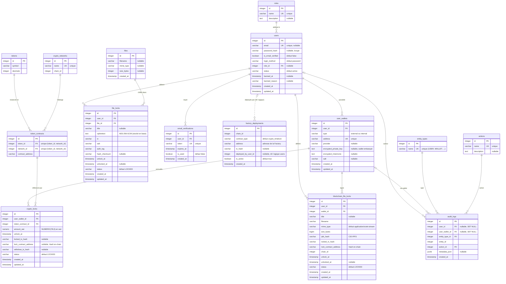
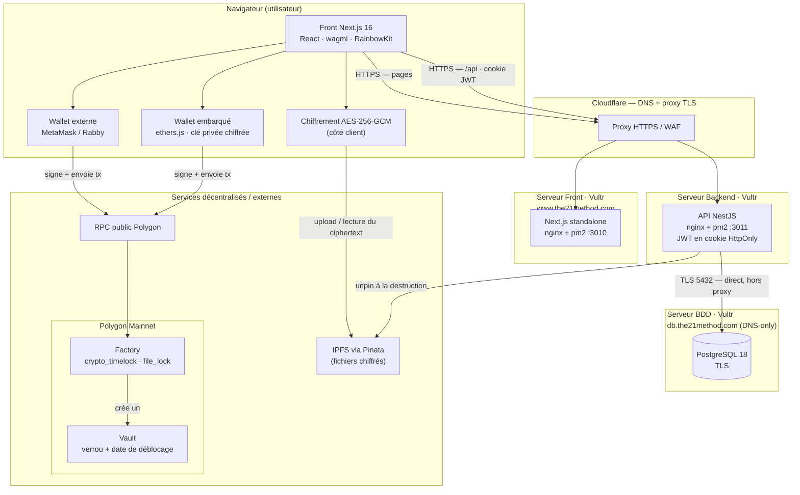

# TimeLock — Diagrammes (MLD + Architecture technique)

> Généré à partir du code réel (entités TypeORM + déploiement de production).
> Les diagrammes sont en **Mermaid** : collables tels quels dans
> [mermaid.live](https://mermaid.live), GitHub, Notion, VS Code (extension Mermaid), etc.

---

## 1. MLD — Modèle Logique de Données

15 tables. Les noms de colonnes sont ceux réellement créés en base (PostgreSQL 18, snake_case).



### Notes de lecture du MLD

- **Cardinalités** : `||--o{` = 1 à 0..N (FK obligatoire) ; `|o--o{` = 0..1 à 0..N
  (FK *nullable*, ex. `users.role_id`, `audit_logs.user_id`).
- **Lien en pointillés** (`users ..o{ factory_deployments`) : `deployed_by_user_id`
  est une **référence logique** vers `users` mais **sans contrainte FK** en base
  (colonne simple, pas de relation TypeORM) — d'où le trait discontinu.
- **Deux mécanismes de verrou de fichier** :
  - `file_locks` (+ `files`) : chiffré **AES-256-GCM**, le *ciphertext* est stocké
    **en base** (colonne `ciphertext`).
  - `blockchain_file_locks` : le fichier chiffré part sur **IPFS** (`ipfs_hash`) et
    le verrou est un **contrat Vault on-chain** (`lock_contract_address`).
- **Suppressions** : la plupart des FK sont en `ON DELETE CASCADE` ; `audit_logs`
  conserve la trace même si l'utilisateur/wallet est supprimé (`ON DELETE SET NULL`) ;
  `entity_types`/`actions` sont protégés (`ON DELETE RESTRICT`).
- **Catalogue crypto** : `tokens` × `crypto_networks` → `token_contracts`
  (une adresse de contrat par couple token/réseau, contrainte d'unicité).

---

## 2. Architecture technique

Déploiement réel : 3 serveurs Vultr distincts (front / back / BDD) derrière
Cloudflare, plus les services décentralisés (IPFS, Polygon).



### Notes de lecture de l'architecture

- **Front et API** passent par **Cloudflare** (DNS + TLS + proxy). La **BDD** est en
  **DNS-only** (gris) : Cloudflare ne proxifie pas le port 5432, le backend s'y
  connecte donc **directement en TLS**.
- **Chiffrement côté client** : la clé AES n'est jamais transmise ; pour les locks
  *blockchain*, elle est dérivée d'une **signature wallet** (même message → même clé).
- **Upload IPFS** : effectué **directement par le navigateur** vers Pinata ; le
  **backend** ne contacte Pinata que pour le *unpin* (destruction d'un fichier).
- **Transactions on-chain** : signées par le **wallet** (externe *ou* embarqué) et
  envoyées via un **RPC public Polygon** ; la `Factory` instancie un `Vault` par verrou.
- **Persistance** : le backend NestJS ne stocke en base que les **métadonnées**
  (CID IPFS, hash de tx, adresse du Vault, dates), jamais les fonds ni le fichier clair.
```
