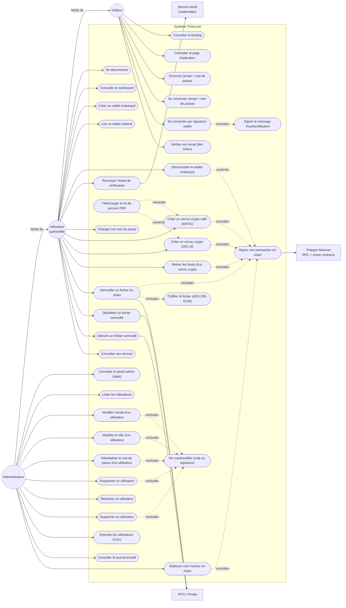

# TimeLock — Diagramme de cas d'utilisation (UML)

> Construit à partir du code réellement branché (routes/contrôleurs/composants
> existants). Les actions en stub (`alert()` non câblées) sont exclues.

---

## (a) Liste des cas d'utilisation par acteur

### Acteur **Visiteur** (non authentifié)
Routes publiques : `/`, `/explication`, `/login`, `/register`, `/verify-email`,
et endpoints `POST /api/auth/register|login|wallet-login|verify-email`.

- **V1** Consulter la landing page (`/`)
- **V2** Consulter la page Explication (`/explication`)
- **V3** S'inscrire avec email + mot de passe
- **V4** Se connecter avec email + mot de passe
- **V5** Se connecter par signature wallet (MetaMask / Rabby / WalletConnect)
- **V6** Vérifier son email via le lien reçu (token)

### Acteur **Utilisateur authentifié** (hérite du Visiteur)
Pages `(app)/*`, JWT en cookie HttpOnly requis.

- **U1** Se déconnecter
- **U2** Consulter son dashboard (résumé global + activité récente)
- **U3** Créer un wallet embarqué (clé privée chiffrée en base)
- **U4** Lier un wallet externe à son compte
- **U5** Déverrouiller le wallet embarqué par mot de passe (pour signer)
- **U6** Renvoyer l'email de vérification
- **U7** Changer son mot de passe (comptes email uniquement)
- **U8** Créer un verrou crypto **natif** (MATIC, payable on-chain)
- **U9** Créer un verrou crypto **ERC-20** (approve + createLock)
- **U10** Retirer les fonds d'un verrou crypto arrivé à échéance
- **U11** Télécharger le kit de secours PDF post-création (`CryptoRescueKitModal`)
- **U12** Verrouiller un fichier on-chain (AES-256-GCM client → IPFS → Vault)
- **U13** Déchiffrer un fichier après échéance (fetch IPFS + signature → clé AES)
- **U14** Détruire un fichier verrouillé (unpin Pinata + suppression base)
- **U15** Consulter ses verrous (crypto + fichiers)

### Acteur **Administrateur** (hérite de l'Utilisateur authentifié)
Sidebar « Administration », endpoints `/api/admin/**` gardés par `ensureAdmin`.

- **A1** Consulter le panel admin (stats globales)
- **A2** Lister les utilisateurs (pagination + filtres + tri + recherche)
- **A3** Modifier l'email d'un utilisateur
- **A4** Modifier le rôle d'un utilisateur
- **A5** Réinitialiser le mot de passe d'un utilisateur (comptes email)
- **A6** Suspendre un utilisateur *(soft-delete)*
- **A7** Réactiver un utilisateur suspendu
- **A8** Supprimer définitivement un utilisateur
- **A9** Exporter la liste filtrée des utilisateurs en CSV (RFC-4180)
- **A10** Consulter le journal d'audit (paginé + filtré action/entité)
- **A11** Déployer un smart contract Factory (`crypto_timelock` / `file_lock`)

### Acteurs secondaires (systèmes externes)
- **Polygon Mainnet** (RPC public + smart contracts Factory/Vault) — destinataire de toute signature on-chain.
- **IPFS / Pinata** — stockage du ciphertext (upload depuis le navigateur, *unpin* depuis le backend).
- **Service email** (nodemailer côté backend) — envoi des emails de vérification.

### Relations **«include»** et **«extend»** observées dans le code
| Cas de base | Type | Cas inclus / extension |
|---|---|---|
| V5 Connexion wallet | «include» | Signer le message d'authentification (avec timestamp anti-rejeu) |
| U8 / U9 / U10 Verrous crypto | «include» | Signer une transaction on-chain |
| U12 Verrouiller un fichier | «include» | Chiffrer le fichier (AES-256-GCM) **+** Signer la transaction on-chain |
| A11 Déployer une Factory | «include» | Signer une transaction on-chain |
| A3 / A4 / A5 / A6 / A8 Action admin sensible | «include» | Re-s'authentifier (mot de passe **ou** signature wallet) |
| Signer une transaction on-chain | «extend» | U5 Déverrouiller le wallet embarqué *(seulement si wallet embarqué utilisé)* |
| U8 / U9 Création de verrou crypto | «extend» | U11 Télécharger le kit de secours PDF *(proposé après création)* |

---

## (b) Diagramme Mermaid (flowchart LR)

> Mermaid ne supporte pas bien le diagramme *use-case* natif → on utilise un
> `flowchart LR` avec : acteurs en cercles à gauche, cas d'utilisation en
> stades dans le sous-graphe « Système TimeLock », acteurs secondaires à droite.
> **Syntaxe validée par le parseur Mermaid v11.**

### Notes de lecture
- **Cercles** = acteurs primaires (UML). **Stades** = cas d'utilisation. **Rectangles à droite** = acteurs secondaires (systèmes externes).
- **Flèches pleines** entre acteur ↔ cas = associations standard.
- **Flèches pointillées** étiquetées `«include»` / `«extend»` = relations UML entre cas d'utilisation (lecture : la flèche pointe **vers le cas inclus / l'extension**).
- **Généralisation des acteurs** : `Administrateur → Utilisateur → Visiteur` (le spécialisé pointe vers le général ; l'admin hérite donc de tout ce que peut faire un utilisateur authentifié, qui hérite lui-même de tout ce que peut faire un visiteur).
- L'**«extend»** « Déverrouiller le wallet embarqué » sur « Signer une transaction » modélise le cas où l'utilisateur signe avec son wallet *interne* (la confirmation par mot de passe est alors nécessaire) — avec un wallet externe (MetaMask/Rabby) cette extension n'a pas lieu.
